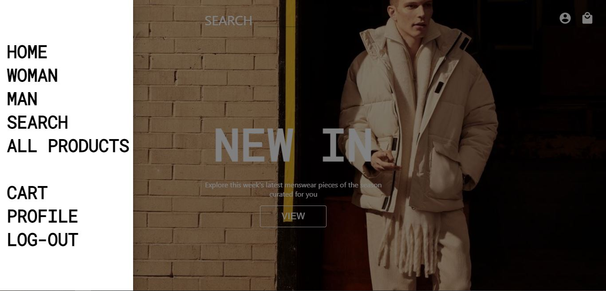
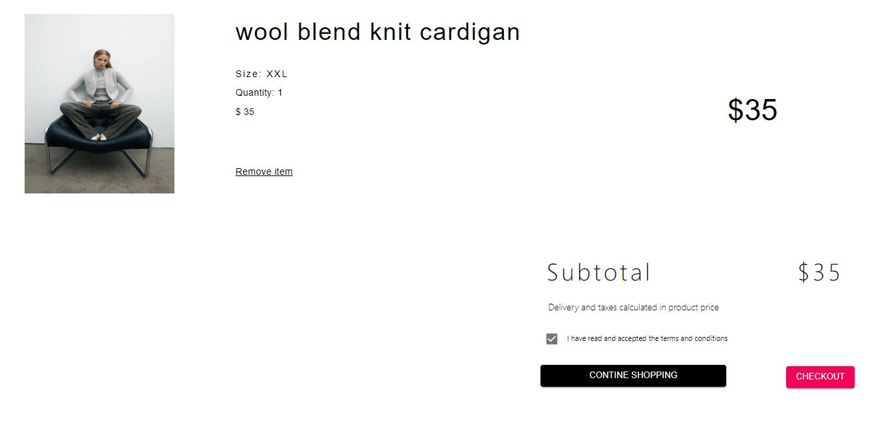

# EcommerceWebsite-master
 
 An E commerce platform made using React JS, Node JS, MongoDB, Stripe API (currently not working).

The application is composed of the following Features:

## Front-End
- A landing page with animated minimalistic design, with new collection of items.
- A quick search bar to search your favourite products
- A page with Sign-in and Sign-out components.
- A Side Navbar to quickly shuffle through the website.
- Has a cart feature which opens up and displays the items selected in a summary, also has a checkout button.

**SCREENSHOTS:**

Landing Page:

---
Product Preview:

---
Sign-in && Sign-Up Page:

---
NavBar:

---
Product Filter:

---
Cart Section:

---

